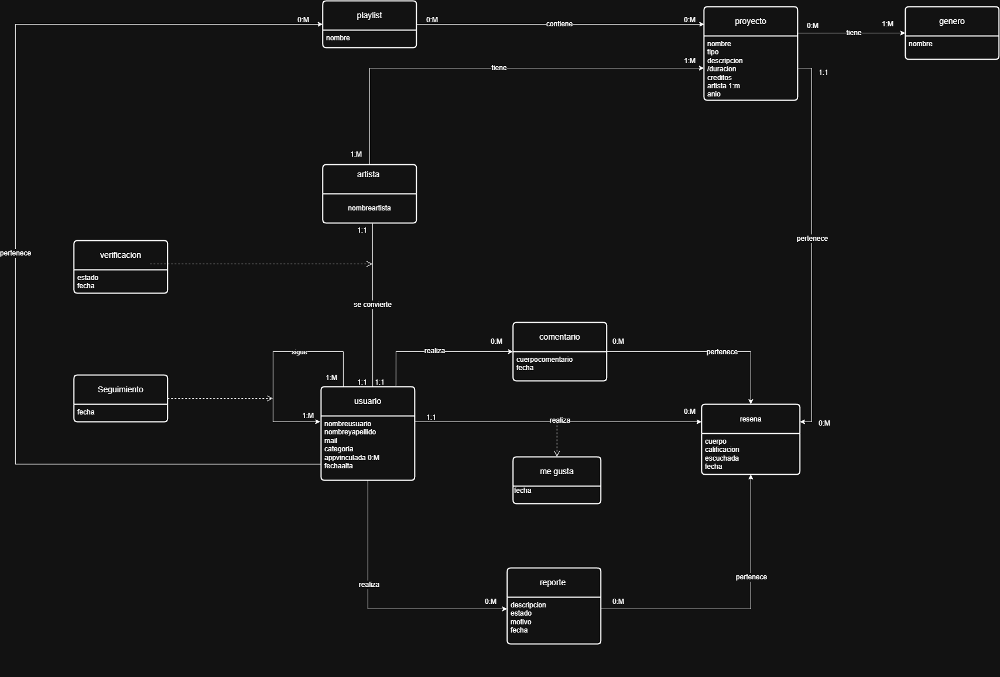

# Propuesta TP DSW

## Grupo
### Integrantes
* 50850 - Acosta, Luciano
* 50730 - Wetzel, Jeffrey 
* 52250 - Bustos, Fausto

### Repositorios
* [frontend app](https://github.com/lucianoacosta23/Frontend-dsw)
* [backend app](https://github.com/lucianoacosta23/backend-dsw)
*Nota*: si utiliza un monorepo indicar un solo link con fullstack app.

## Tema
### Descripción
Se desarrollará un sistema que permitirá a los usuarios calificar y reseñar proyectos de artistas musicales, incluyendo canciones y sus distintas variantes de álbumes (single, EP y mixtape). Además, el sistema contará con un perfil de administrador que tendrá la capacidad de gestionar a los usuarios y sus reseñas, pudiendo, entre otras acciones, dar de baja tanto cuentas, como sus reseñas.

### Modelo

## Alcance Funcional 

### Alcance Mínimo

|Req|Detalle|
|:-|:-|
|CRUD simple|1. CRUD Usuario 2. CRUD Proyecto  3. CRUD Artista|
|CRUD dependiente|1. CRUD Reseña {depende de} CRUD Usuario y CRUD Proyecto  2. CRUD Reporte {depende de} CRUD Reseña y CRUD usuario|
|Listado + detalle| 1. Listado de Proyectos filtrado por genero, artista, nombre y tipo de proyecto => detalle CRUD Proyectos  2. Listado de usuarios filtrado por nombre => detalle muestra datos completos del usuario.|
|CUU/Epic|1. Reseñar de la lista "populares"  2. Reportar un usuario o Reseña.|

Adicionales para Aprobación
|Req|Detalle|
|:-|:-|
|CRUD |1. CRUD Usuario 2. CRUD Proyecto 3. CRUD Artista 4. CRUD Genero 5. CRUD Reporte  6. CRUD Playlist 7. CRUD Reseña|
|CUU/Epic|1. Reseñar de la lista "populares" 2. Reportar un usuario o Reseña. 3. Realizar una reseña|

### Alcance Adicional Voluntario

|Req|Detalle|
|:-|:-|
|Listados |1. Listado de comentarios filtrado por popularidad y antiguedad|
|CUU/Epic|1.Comentar una reseña |
|Otros|1. Envío de actividad via mail (like, follow, reply)|

